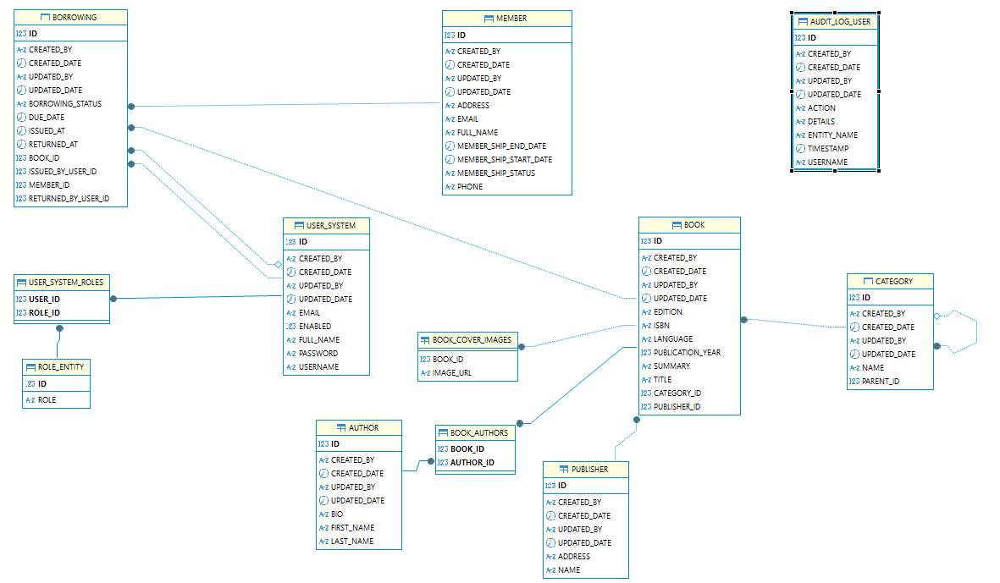

# Library Management System (Spring Boot)

A production-style backend for managing a library: books, authors, publishers, categories, members, borrowings, users/roles, and activity auditing. The project follows a layered architecture with DTO/VM separation, MapStruct mappers, and Oracle database with Flyway migrations.

## Table of Contents
- [Architecture & Design](#architecture--design)
- [Project Structure](#project-structure)
- [Key Design Choices](#key-design-choices)
- [Security](#security)
- [Validation & Error Handling](#validation--error-handling)
- [Database & Migrations](#database--migrations)
- [How to Run](#how-to-run)
- [API Overview](#api-overview)
- [ERD](#erd)
- [Postman Collection](#postman-collection)

---

## Architecture & Design
- **Layered structure**: controller → service → repository. Entities are never exposed directly; data flows via DTOs and VMs.
- **DTO vs VM**:
  - DTOs (in `dto/`) represent data returned by services and controllers.
  - VMs (in `vm/`) represent request and response models tailored for the API.
- **MapStruct Mappers** (in `mapper/`) convert between Entity ↔ DTO ↔ VM, keeping mapping logic centralized and type-safe.
- **Pagination** centralized in `service/PaginationService`.
- **Audit/Activity Log** via `ActivityUser` entity and `ActivityUserService` to record actions.
- **Security**: JWT-based authentication with `AuthFilter` and Spring Security configuration and authorization annotations on controllers.

## Project Structure
```
src/main/java/com/spring/boot/librarymanagementsystem/
  config/security/          # Security configuration, filters, token handler
  controller/               # REST controllers
  dto/                      # Data Transfer Objects
  entity/                   # JPA entities (schema LIBRARY_SYSTEM)
  exception/                # Custom exceptions and handlers
  mapper/                   # MapStruct mappers
  repository/               # Spring Data JPA repositories
  service/                  # Service interfaces and shared services
  service/implementation/   # Service implementations
  utils/                    # Enums and helpers
  vm/                       # View Models (request/response) grouped by feature
src/main/resources/
  application.yml           # Spring & DB config
  db/migration/             # Flyway migrations (Oracle)
```

## Key Design Choices
- **Clear separation of concerns**:
  - Controllers validate/shape requests and delegate to services.
  - Services encapsulate business logic and validation.
  - Repositories handle persistence with Spring Data JPA.
- **MapStruct** for low-boilerplate, consistent object mapping.
- **Validation**: Jakarta Validation annotations on VMs and DTOs.
- **Exception strategy**: Custom runtime exceptions (`BadRequestException`, `NotFoundResourceException`, etc.) surfaced as proper HTTP responses by a global handler (extensible).
- **Oracle** chosen as target DB; Flyway manages schema changes/seeding.
- **Audit logging**: `ActivityUserService` records actions (e.g., create/update/delete borrowing) for traceability.

## Security
- **AuthFilter** parses `Authorization: Bearer <token>`, validates via `TokenHandler`, and sets `SecurityContextHolder` authentication.
- Endpoints guarded using `@PreAuthorize` with role checks (e.g., `hasAnyRole('ADMIN','LIBRARIAN')`).
- Recommended practice for 401 responses: set `WWW-Authenticate: Bearer` and a small JSON body via a custom `AuthenticationEntryPoint` (optional enhancement).

## Validation & Error Handling
- Request VMs annotated with `@NotNull`, `@NotEmpty`, `@Email`, `@Pattern`, etc.
- Services check IDs and domain rules (e.g., borrowing dates, membership periods) and throw descriptive exceptions.
- Consistent error responses can be implemented via global `@ControllerAdvice` (extend as needed).

## Database & Migrations
- **Database**: Oracle (thin driver), schema `LIBRARY_SYSTEM`.
- **Flyway**: enabled and configured in `application.yml`.
- **Migrations** (examples):
  - `V1__insert_roles.sql` – seed roles (STAFF, ADMIN, LIBRARIAN)
  - `V2__alter_foreign_key_category.sql` – parent category FK with `ON DELETE SET NULL`
  - `V3__insert_admin.sql` – create admin user and grant ADMIN role
  - (If needed) Add a migration to create audit table consistent with `entity/ActivityUser.java` (see ERD and example DDL below)

## How to Run

### Prerequisites
- Java 17+
- Maven 3.8+
- Oracle Database accessible at `jdbc:oracle:thin:@//localhost:1521/orcl`
  - User: `LIBRARY_SYSTEM`
  - Password: `LIBRARY_SYSTEM`
  - Ensure schema `LIBRARY_SYSTEM` exists and user has privileges.

### Configuration
- Update `src/main/resources/application.yml` if your Oracle URL, username, or password differ.
- Flyway is enabled and will run migrations at startup.

### Build & Run
```bash
mvn clean package -DskipTests
java -jar target/LibraryManagementSystem-0.0.1-SNAPSHOT.jar
```

Server will start on `http://localhost:9090`.

### Authentication
- Use `/auth/sign-up` to create a user, and `/auth/login` to obtain a JWT.
- Include header `Authorization: Bearer <token>` for protected endpoints.

## API Overview
- **Auth**: `POST /auth/login`, `POST /auth/sign-up`; admin user and roles seeded via Flyway.
- **Users**: `GET/PUT/DELETE /auth/...` endpoints for listing/updating/deleting users (guarded by roles).
- **Authors**: `/authors/...` CRUD-like operations.
- **Publishers**: `/publishers/...` with extra endpoint to fetch publisher with books.
- **Categories**: `/categories/...` operations.
- **Books**: `/books/...` CRUD and paginated listing.
- **Members**: `/members/...` create, update, list, delete.
- **Borrowings**: `/borrowings/...` add, update, list, get (with/without relations), delete.
- **Activities**: `GET /activities/get-activities` (admin-only) – paginated audit entries.

Each controller returns a `SuccessDto<ResponseEntity<...>>` wrapper for consistency.

## ERD




---

## Postman Collection

Import the provided Postman collection to quickly exercise the API.

- File path: `docs/postman/LibraryManagementSystem.postman_collection.json`
- Variables:
  - `baseUrl` (default: `http://localhost:9090`)
  - `token` (set this after calling `/auth/login`)

Steps:

1. Open Postman → File → Import → select the JSON collection file.
2. Open the collection's Variables tab and set `baseUrl` and `token`.
3. Run requests in the folders (Auth → Login first, then copy the token into the collection variables).

Notes:

- Admin-only endpoints require a user with `ADMIN` role (seeded via Flyway in `V3__insert_admin.sql`).
- Adjust payloads and IDs to match your local data after migrations.